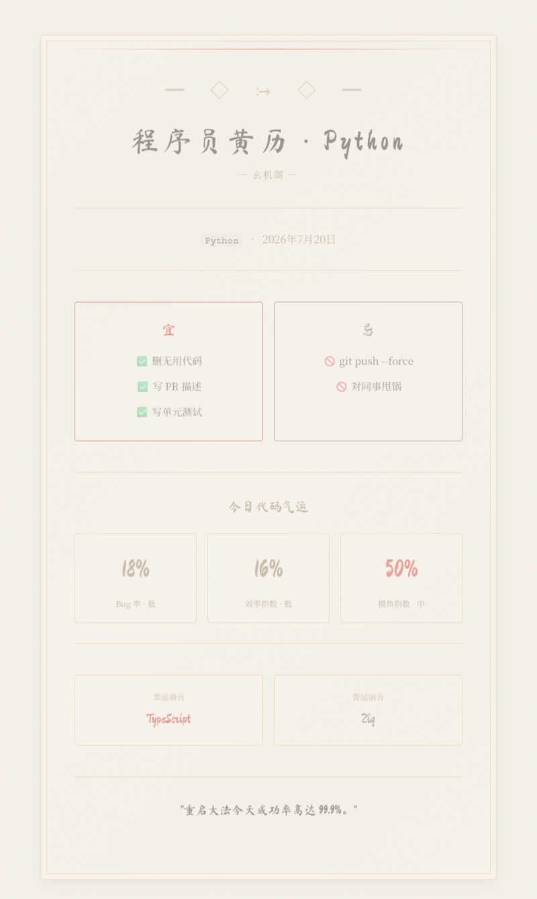

<div align="center">

# 🔮 玄机阁 · suanming-mcp

**传统中国风 × 程序员整活风 &nbsp;|&nbsp; 水墨 HTML 命理报告 &nbsp;|&nbsp; 八字 · 六爻 · 抽签 · 起名 · 程序员黄历**

**English** → [docs/README.en.md](./docs/README.en.md)

[](https://github.com/Enoch666/suanming-mcp/stargazers)
[](https://modelcontextprotocol.io)
[](https://www.typescriptlang.org/)
[](https://www.npmjs.com/package/suanming-mcp)
[](./LICENSE)
[](./SKILL.md)

</div>

> **提示**：项目目前还在持续迭代中，欢迎 Star + Watch 关注更新，也欢迎提 Issue 和 PR 一起整活。

---

一个基于 MCP (Model Context Protocol) 的算命 Server，**零外部依赖**（仅 MCP SDK），生成墨韵宣纸质感的 HTML 命理报告。支持 **Claude Code**、**Codex**、**OpenCode**、**Cursor**、**Windsurf** 及所有 MCP 兼容工具。

## ✨ 六大算命功法

| Tool | 功能 | 输入 | 输出 | 风格 |
|------|------|------|------|------|
| `fortune_bazi` | 八字排盘 | 出生年月日时 + 性别 | 四柱八字、五行分布、日主分析、今日运势 | 🏮 传统 |
| `fortune_liuyao` | 六爻起卦 | 心中问题（可选） | 本卦变卦、变爻位置、卦象解读 | 🏮 传统 |
| `fortune_qian` | 灵签抽签 | 心中问题（可选） | 签号签文、七言签诗、解签白话 | 🏮 传统 |
| `fortune_name` | 姓名打分 | 姓名（2-4字） | 五格剖象、81数理、三才配置、综合评分 | 🏮 传统 |
| `fortune_mingming` | 起名 | 姓氏 + 生辰（可选） | 5个候选名字、五行分析、寓意解读 | 🏮 传统 |
| `fortune_coder` | 程序员黄历 | 编程语言 | 今日宜忌、Bug率/效率/摸鱼指数、幸运语言 | 💻 整活 |

每次算命结果都会生成一个**水墨风格 HTML 页面**，自动在浏览器中打开，宣纸纹理 + 毛笔字体 + 朱砂印章。

## 🎨 水墨 HTML 视觉

所有算命结果均渲染为统一风格的水墨 HTML 页面：

| 视觉元素 | 实现 |
|---------|------|
| 宣纸纹理背景 | CSS 多层噪点叠加模拟 |
| 毛笔书法标题 | Google Fonts `Ma Shan Zheng`（马山正） |
| 正文宋体 | `Noto Serif SC` / `SimSun` |
| 朱砂印章 | CSS 圆角方形 + 旋转 15°，刻"玄机阁印" |
| 八卦符号 | Unicode 原生 ☰☱☲☳☴☵☶☷ |
| 淡入动画 | 页面加载时内容从墨色渐显 |
| 竖排签文 | CSS `writing-mode: vertical-rl` |

配色：宣纸底 `#f5f0e8`，浓墨字 `#2c2416`，朱砂红 `#c41e1e`，淡墨线 `#8b7355`。

HTML 文件保存在 `~/.suanming/` 目录下。

## 📸 效果预览

### 八字排盘


### 程序员黄历


### 灵签抽签


*更多截图见 [assets/](./assets/) 目录*

## 📦 安装

```bash
npm install -g suanming-mcp
```

发布后玩家只需一行命令，无需克隆仓库。

### 本地克隆（无需 npm 发布）

如果还没发布到 npm，或者想用最新代码，直接克隆本地使用：

```bash
git clone https://github.com/Enoch666/suanming-mcp.git
cd suanming-mcp
npm install
npm run build
```

然后在 `.mcp.json` 中指向本地 `dist/index.js`：

```json
{
  "mcpServers": {
    "suanming": {
      "command": "node",
      "args": ["克隆目录的完整路径/dist/index.js"]
    }
  }
}
```

> **注意**：`args` 里要写你电脑上的**绝对路径**，比如 `D:/workspace/study/算命/dist/index.js`。Windows 用正斜杠 `/`，不要用反斜杠 `\`。

## ⚙️ 配置

### Claude Code

创建项目根目录的 `.mcp.json`（当前项目生效）或 `~/.claude/.mcp.json`（全局生效）：

```json
{
  "mcpServers": {
    "suanming": {
      "command": "npx",
      "args": ["-y", "suanming-mcp"]
    }
  }
}
```

### OpenCode

在 `opencode.yaml` 中添加：

```yaml
mcp_servers:
  suanming:
    command: npx
    args:
      - "-y"
      - suanming-mcp
```

### Cursor / Windsurf / Claude Desktop

在对应 MCP 配置文件中添加同上格式的 server 配置即可。

配置完成后**重启工具**，MCP Server 即自动加载。

## 🎯 使用指南

配置完成后直接用自然语言对话触发，无需记忆指令：

### 八字排盘 `fortune_bazi`

```
帮我算个八字，1990年5月20日上午10点出生，男
查一下2000年1月1日早上8点生的女的八字
```

**输入参数**：`year`, `month`, `day`, `hour`（24小时制）, `gender`（male/female）

> 8字排盘页展示年柱、月柱、日柱、时柱，五行分布统计，日主性格分析，今日运势预测。

### 六爻起卦 `fortune_liuyao`

```
起个卦问问事业前程
算一卦看看这段感情
```

**输入参数**：`question`（可选，不填默认为"运势"）

> 起卦页展示本卦与变卦的八卦符号、卦名、卦辞、爻位详情，标注变爻位置。

### 抽签 `fortune_qian`

```
抽个签看看财运
给我抽一支灵签
```

**输入参数**：`question`（可选）

> 签文页展示签号、吉凶等级标签（上上/上/中/下等，带颜色区分）、竖排七言签诗、白话解签。

### 姓名打分 `fortune_name`

```
分析一下"张三"这个名字
评测王五这个姓名多少分
```

**输入参数**：`name`（2-4个字，必填）

> 评分页展示天格/人格/地格/外格/总格的笔画数、81数理吉凶、三才配置分析、综合评分与星级。

### 起名 `fortune_mingming`

```
姓李，2024年3月15日早上8点生，帮我起几个名字
姓张，男孩，起三个字的名字
```

**输入参数**：`surname`（必填）, `year/month/day/hour`（可选）, `gender`（可选）

> 起名页展示候选名字列表，每个名字附带五格评分、五行属性、寓意解读，推荐最优选项。

### 程序员黄历 `fortune_coder`

```
今天适合写Python吗
查查程序员黄历
看下今天的代码运势
```

**输入参数**：`language`（必填，如 Python / JavaScript / Rust / Go 等）

> 黄历页展示今日宜忌（幽默向，如"宜写单元测试""忌周五下午部署"）、Bug率/效率/摸鱼三项指数、幸运语言/背运语言、一句程序员忠告。

> 同一日期同一语言结果一致，不会每次刷新都变。

## 🏗️ 项目结构

```
suanming-mcp/
├── src/
│   ├── index.ts                    # MCP Server 入口（注册6个tool + stdio传输）
│   ├── render/
│   │   └── template.ts             # 水墨 HTML 模板引擎
│   ├── data/
│   │   ├── hexagrams.ts            # 64卦完整数据
│   │   ├── qianwen.ts              # 100首灵签签文
│   │   └── characters.ts           # 200+起名用字库 + 姓氏笔画表
│   └── tools/
│       ├── bazi-helpers.ts         # 共享天干地支常量
│       ├── bazi.ts                 # 八字排盘
│       ├── liuyao.ts               # 六爻起卦
│       ├── qian.ts                 # 抽签
│       ├── name.ts                 # 姓名打分
│       ├── mingming.ts             # 起名
│       └── coder.ts                # 程序员黄历
├── assets/                         # 截图和预览
├── docs/                           # 文档
├── SKILL.md                        # Agent Skill 定义
├── package.json
├── tsconfig.json
└── README.md
```

## 🔧 本地开发

```bash
git clone https://github.com/Enoch666/suanming-mcp.git
cd suanming-mcp
npm install
npm run build          # 编译 TypeScript → dist/
npm start              # 启动 MCP Server（stdio 模式）
```

### 冒烟测试

```bash
node -e "
const { fortuneCoder } = require('./dist/tools/coder.js');
fortuneCoder({ language: 'Python' }).then(r => {
  console.log(r.summary);
  console.log('HTML:', r.htmlPath);
});
"
```

## 📤 发布到 npm

```bash
npm login              # 首次：npmjs.com 免费注册
npm run build          # 确保 dist/ 是最新的
npm publish            # 一行命令发布
```

发布后用户即可通过 `npx -y suanming-mcp` 零安装使用。

## 🎯 适用场景

| 场景 | 适用程度 | 说明 |
|------|----------|------|
| 学习传统命理知识 | 很适合 | 从八字排盘、六爻占卜、签文等多角度了解 |
| 程序员日常整活 | 很适合 | 程序员黄历幽默风趣，适合团队轻松一刻 |
| 起名参考 | 适合 | 八字五行补缺生成候选名，五格打分辅助决策 |
| 娱乐消遣 | 很适合 | 抽签、黄历轻松有趣，三五好友一起玩 |
| 专业命理论断 | 不适合 | 仅供娱乐参考，不提供个人化命理建议 |
| 医疗诊断 | 绝对不适合 | 算命 ≠ 医疗行为，身体不适请去医院 |

## ⚠️ 免责声明

本项目仅供娱乐和学习参考。涉及医疗、投资、法律等重要决策，请咨询相关专业人士。详见 [docs/USE_AND_RISK_NOTICE.md](./docs/USE_AND_RISK_NOTICE.md)。

## 🤝 参与贡献

欢迎提 Issue、PR 一起整活！欢迎贡献：
- 更多程序员幽默条目
- 签文库扩充
- 起名用字库扩充
- 新的算命功法
- 视觉优化

## 📄 License

MIT © 2026

---

<p align="center">
  <sub>Made with 🔮 by 玄机阁 | 仅供娱乐，切勿迷信</sub>
</p>
